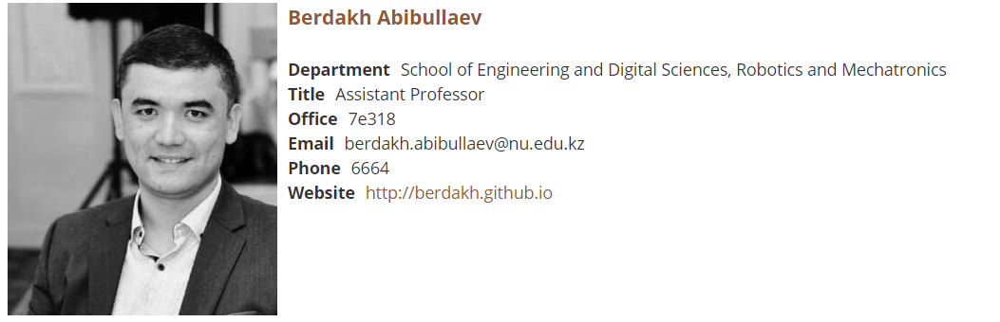

## Research expertise

-   Brain-Computer/Machine Systems engineer with extensive experience in
    analyzing Brain data (EEG, ECoG, MEG, NIRS) for a real-time/offline
    mental state recognition.

-   Deep expertise in developing and applying machine learning methods
    for mining neurophysiological data both from healthy subjects as
    well as patients with Stroke and Epilepsy disorders.

-   Successfully collaborated with clinicians at medical centers in
    joint research on Stroke rehabilitation and Epilepsy surgery i.e.
    localization of epileptogenic zones from Brain data.

## Short Biography: 

Dr. Berdakh Abibullaev received his M.Sc. and Ph.D. degrees in electronic engineering from Yeungnam University, South Korea in 2006 and 2010 under the Korean Government Scholarship program. He held research scientist positions at Daegu-Gyeongbuk Institute of Science and Technology  (2010-2013) and Samsung Medical Center, South Korea (2013-2014). He was also appointed as a research professor at Sungkyunkwan University, Seoul. In 2014, he received NIH (National Institute of Health,  USA), a postdoctoral research fellowship to join a research project between the University of Houston Brain-Machine Interface Systems Team and a Texas Medical Center in developing neural interfaces for rehabilitation in post-stroke patients.  Currently, he is an Assistant Professor in the Department of Robotics and Mechatronics,  Nazarbayev University,  Kazakhstan. His research focuses on developing robust Brain-Computer/Machine Interfaces for communication and rehabilitation of people with severe motor impairments.

Dr. Abibullaev has considerable research and clinical experience working with patient populations and physicians in applying scientific and technical skills to advance the development of treatments for neurological disorders.  

His current research focuses on designing robust neural-interfaces to control a robotic device for human augmentation, and advancing machine learning algorithms to develop new and alternative solutions to inference problems of Brain-Computer/Machine Interfaces.  

## Selected Publications

Check out his:: [Google scholar](https://scholar.google.co.kr/citations?hl=en&user=KvECkz0AAAAJ&view_op=list_works&sortby=pubdate) :: for recent publications. 

<u>B. Abibullaev</u>, I. and A. Zollanvari. A Brute-force CNN Model
Selection for Accurate Classification of Sensorimotor Rhythms in BCIs
*IEEE Access*, 2020, in press, *(Impact Factor: 4; Quartile rank: Q1)*.

A. Zollanvari, M. Abdirash, A. Dadlani and <u>B. Abibullaev</u>.
Asymptotically Bias-Corrected Regularized Linear Discriminant Analysis
for Cost-Sensitive Binary Classification *IEEE Signal Processing
Letters*, 2019, *(Impact Factor: 2.8; Quartile rank: Q1)*.

<u>B. Abibullaev</u> and A. Zollanvari. Learning Discriminative
Spatiospectral Features of ERPs for Accurate Brain-Computer Interfaces
*IEEE Journal of Biomedical and Health Informatics*, vol. 98, pp. 1-12,
2019; *(Impact Factor: 5; Quartile rank: Q1)*.

<u>B. Abibullaev</u>, A. Zollanvari, B. Saduanov, and T. Alizadeh.
Design and Optimization of a BCI-Driven Telepresence Robot Through
Programming by Demonstration. *IEEE Access*, 2019, vol. 7, *(Impact
Factor: 4; Quartile rank: Q1)*.

N.A. Bhagat, A. Venkatakrishnan, <u>B. Abibullaev</u>, E.J. Artz, N.
Yozbatiran, A. Blank, J. French, C. Karmonik, R.G.Grossman, M.K
O’Malley, G. Francisco, J.L. Contreras-Vidal. Design and optimization of
an EEG-based brain machine interface (BMI) to an upper-limb exoskeleton
for stroke survivors. , vol. 10, March, 2016 (Impact Factor: 3.566;
Quartile rank: Q1).

J.G. Cruz-Garza, Z.R. Hernandez, T. Tse, E. Caducoy, <u>B.
Abibullaev</u>, J.L. Contreras-Vidal. A novel experimental and
analytical approach to the multimodal neural decoding of intent during
social interaction in freely-behaving human infants. , doi:
10.3791/53406, October, 2015 (Impact Factor : 1.232; Quartile rank: Q2).

C.H. Park, J.H Seo, D. Kim, <u>B. Abibullaev</u>, H. Kwon, Y.H. Lee,
M.Y. Kim, K. Kim, J.S. Kim, E.Y. Joo, S.B. Hong, (2015, Feb). Source
Imaging in Partial Epilepsy in Comparison with Presurgical Evaluation
and Magnetoencephalography. *Journal of Clinical Neurology*, 2015 Feb
17, 11:e12 (Impact Factor : 2.596; Quartile rank: Q2).

### Patents 
J. An, S.H. Jin, S.H. Lee, J.I. Moon <u>B. Abibullaev</u>, J.H. Ahn and
G.H. Jang. REHABILITATION TRAINING SYSTEM AND METHOD. :
9,081,890,Washington, DC: United States. Patent and Trademark Office,
2015 (https://www.google.com/patents/US9081890).

J. An, S.H. Jin, S.H. Lee, J.I. Moon <u>B. Abibullaev</u>, J.H. Ahn and
G.H. Jang. Self-directed rehabilitation training method combining brain
signals and functional electro-stimulation. : 17077057, *Application
number*: 14049302, 09-OCT-2013, United States,
(http://www.google.com/patents/US20140200632).

 